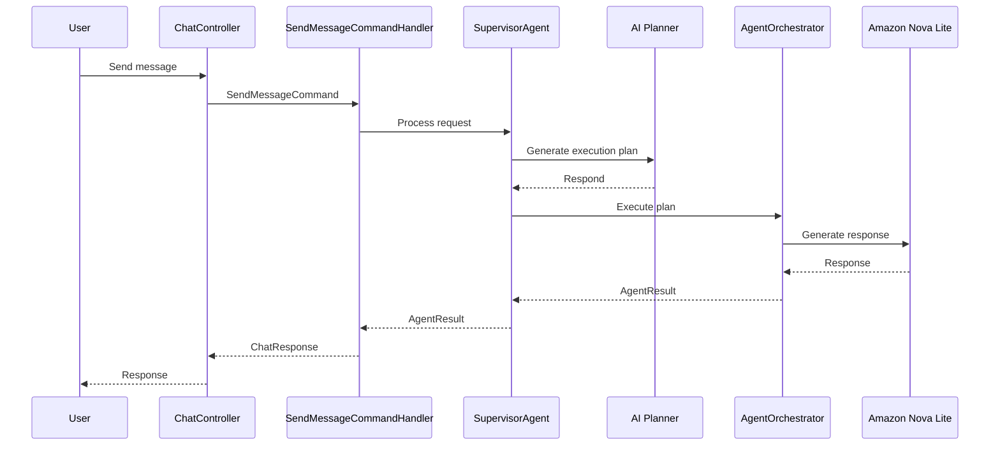
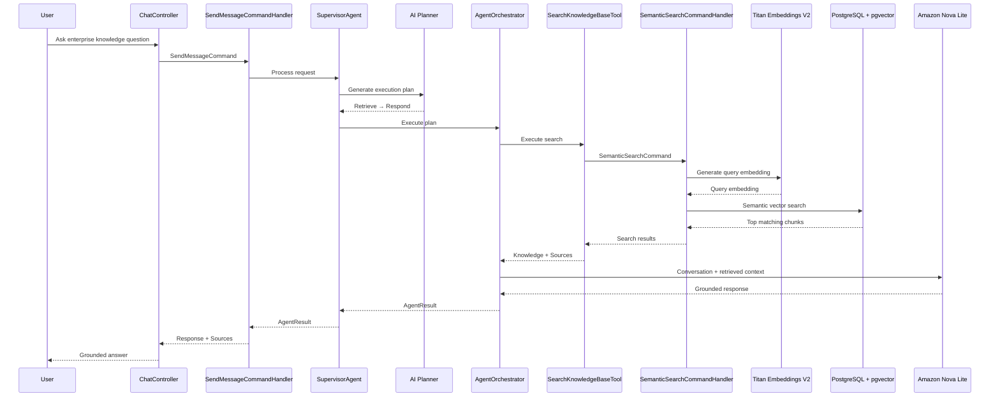
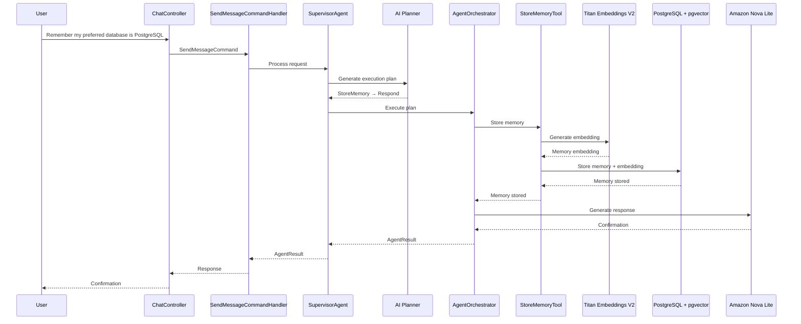
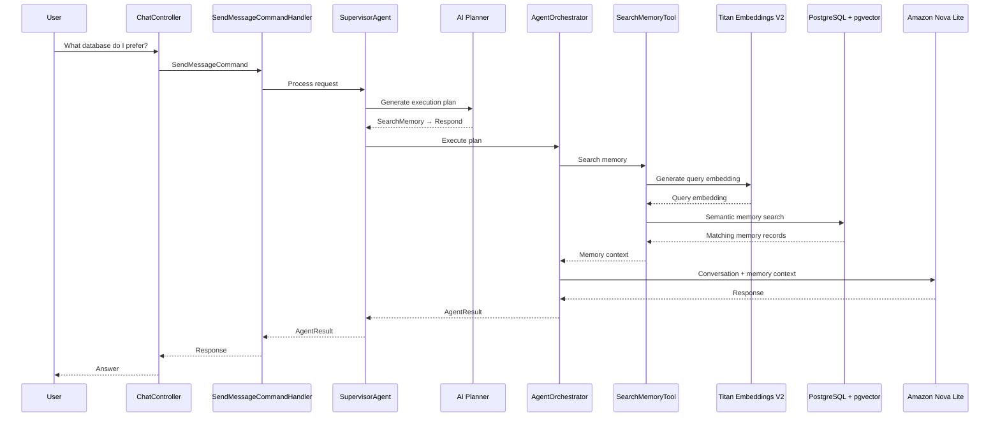
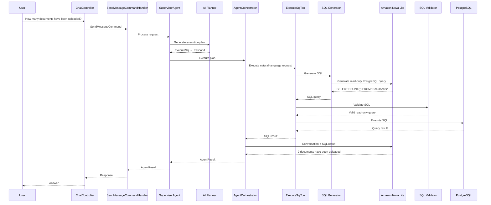
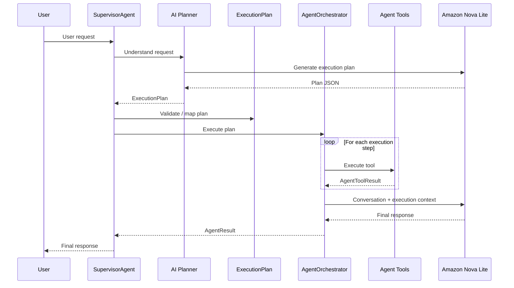
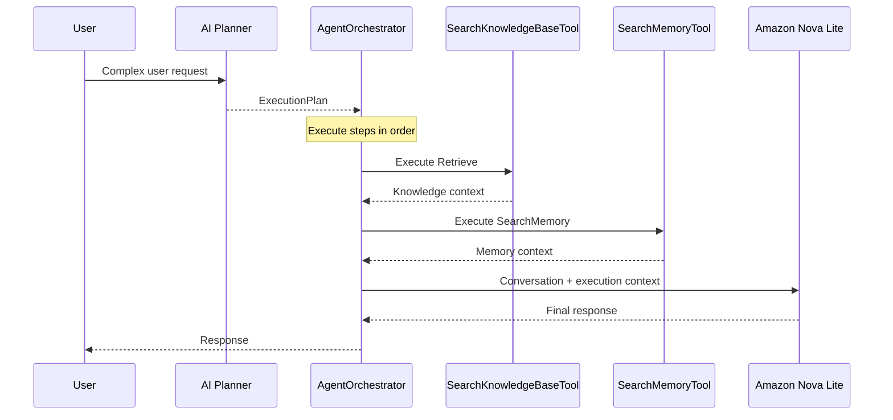

# Sequence Diagram

# Sequence Diagrams

This document describes the main runtime flows of the Enterprise Knowledge Assistant.

---

## 1. General Chat

A general conversation does not require enterprise knowledge or agent tools.

---

## 2. RAG / Enterprise Knowledge Query

For questions requiring enterprise knowledge, the planner generates a `Retrieve → Respond` execution plan.

---

## 3. Memory Agent — Store Memory

The planner can identify information that should be stored as long-term memory.

---

## 4. Memory Agent — Search Memory

The planner can search previously stored memories when the user asks about remembered information.

---

## 5. SQL Agent

The SQL Agent handles questions that require querying structured enterprise data.

The planner passes a natural-language request to the SQL tool. The SQL tool is responsible for SQL generation, validation, and execution.

---

## 6. Agent Planning and Execution

This diagram shows the core agent architecture introduced in Sprint 6 and extended in Sprint 7.

The planner decides **what to do**, while the orchestrator executes the generated plan.

---

## 7. Multi-Step Agent Execution

The planner can generate multiple execution steps when a request requires more than one capability.

---

## Architectural Principle

The agent runtime follows a clear separation of responsibilities.

| Component | Responsibility |
|---|---|
| SupervisorAgent | Coordinates the agent workflow |
| AI Planner | Understands intent and creates an execution plan |
| ExecutionPlan | Represents the planner's requested actions |
| AgentOrchestrator | Executes the generated plan |
| Agent Tools | Perform specific capabilities |
| Amazon Nova Lite | Performs AI planning and response generation |
| PostgreSQL + pgvector | Persistent storage and semantic search |

### Core Design Principle

**The Planner decides what to do.**

**The Orchestrator decides how to execute the plan.**

New capabilities can be introduced as agent tools without changing the core execution model.